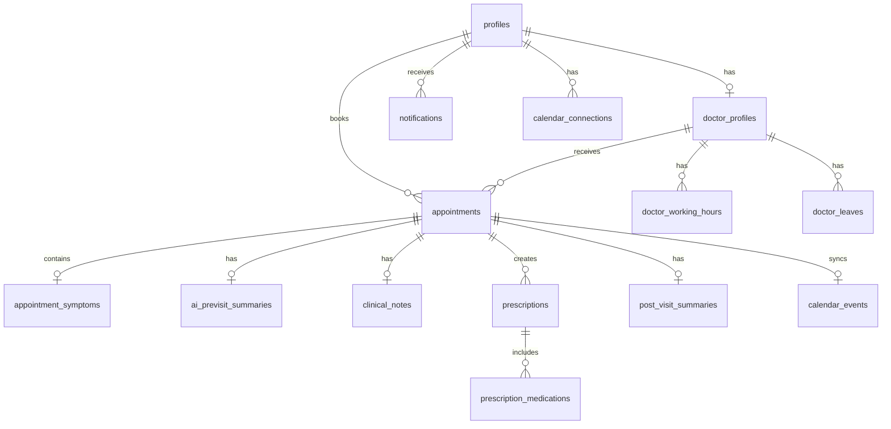

# MediFlow

A production-quality Healthcare Appointment & Follow-up Manager built with Next.js 15, Supabase PostgreSQL, Gemini AI, Resend Email, and Google Calendar.

## Features

### Patient Portal

- Register / Login
- Search doctors by specialisation
- View doctor profiles and availability
- Multi-step booking flow with slot hold countdown
- Submit symptoms before confirmation
- View appointments and history
- View prescriptions and medication schedules
- View AI-generated post-visit summaries
- Connect Google Calendar

### Doctor Portal

- View dashboard with today's appointments
- View patient symptoms and AI pre-visit summaries
- Enter clinical notes, diagnosis, treatment plan
- Create prescriptions with medications
- Complete consultations
- Generate post-visit AI summaries

### Admin Portal

- System dashboard with statistics
- Manage doctors (create, edit, configure)
- Configure working hours per doctor
- Manage doctor leave with conflict detection
- View all appointments
- View notification failures

## Tech Stack

| Layer              | Technology                 |
| ------------------ | -------------------------- |
| Frontend + Backend | Next.js 15 (App Router)    |
| UI                 | Tailwind CSS, Lucide React |
| Forms              | React Hook Form + Zod      |
| Database           | Supabase PostgreSQL        |
| Auth               | Supabase Auth              |
| AI                 | Google Gemini              |
| Email              | Resend                     |
| Calendar           | Google Calendar API        |

## Architecture

Modular Next.js monolith with:

- **PostgreSQL exclusion constraints** for double-booking prevention
- **Atomic RPC functions** for booking operations
- **Supabase RLS** for row-level security
- **Cron endpoints** for background processing
- **Service-role client** for privileged server operations

See [docs/system-design.md](docs/system-design.md) for detailed architecture.

## Setup

### 1. Prerequisites

- Node.js 18+
- A [Supabase](https://supabase.com) project
- (Optional) Google Gemini API key
- (Optional) Resend API key
- (Optional) Google Cloud project with Calendar API enabled

### 2. Clone and Install

```bash
git clone <repository-url>
cd MediFlow
npm install
```

### 3. Environment Variables

```bash
cp .env.example .env.local
```

Fill in your Supabase credentials:

```
NEXT_PUBLIC_SUPABASE_URL=https://your-project.supabase.co
NEXT_PUBLIC_SUPABASE_ANON_KEY=your-anon-key
SUPABASE_SERVICE_ROLE_KEY=your-service-role-key
```

### 4. Database Setup

In your Supabase SQL Editor, run the migrations in order:

1. `supabase/migrations/001_initial_schema.sql`
2. `supabase/migrations/002_rls_policies.sql`
3. `supabase/migrations/003_appointment_booking_function.sql`

### 5. Seed Data

Run `supabase/seed.sql` in your Supabase SQL Editor.

Then create auth users via the Supabase dashboard or register through the app.

### 6. Run

```bash
npm run dev
```

Visit [http://localhost:3000](http://localhost:3000)

## Demo Accounts

| Role    | Email               | Password    |
| ------- | ------------------- | ----------- |
| Admin   | admin@example.com   | password123 |
| Doctor  | doctor@example.com  | password123 |
| Patient | patient@example.com | password123 |

## Database Schema



## API Endpoints

| Method          | Endpoint                              | Description          |
| --------------- | ------------------------------------- | -------------------- |
| POST            | /api/auth/register                    | Register new user    |
| POST            | /api/auth/login                       | Login                |
| POST            | /api/auth/logout                      | Logout               |
| GET             | /api/auth/me                          | Get current profile  |
| GET             | /api/doctors                          | List doctors         |
| GET             | /api/doctors/[id]                     | Get doctor profile   |
| GET             | /api/doctors/[id]/slots               | Get available slots  |
| POST            | /api/appointments/hold                | Hold a slot          |
| POST            | /api/appointments                     | Confirm booking      |
| GET             | /api/appointments                     | List appointments    |
| GET             | /api/appointments/[id]                | Get appointment      |
| PATCH           | /api/appointments/[id]                | Update status        |
| POST            | /api/appointments/[id]/consultation   | Save clinical notes  |
| POST            | /api/appointments/[id]/prescription   | Create prescription  |
| GET             | /api/prescriptions                    | List prescriptions   |
| GET             | /api/admin/stats                      | Dashboard stats      |
| GET             | /api/admin/doctors                    | List doctors (admin) |
| POST            | /api/admin/doctors                    | Create doctor        |
| POST            | /api/admin/doctors/[id]/working-hours | Update hours         |
| GET/POST/DELETE | /api/admin/leave                      | Manage leave         |
| GET             | /api/health                           | Health check         |

## Background Jobs (Cron Endpoints)

| Endpoint                            | Description                  |
| ----------------------------------- | ---------------------------- |
| GET /api/cron/expire-holds          | Expire held slots            |
| GET /api/cron/process-notifications | Process pending emails       |
| GET /api/cron/process-reminders     | Process medication reminders |

All cron endpoints require `Authorization: Bearer <CRON_SECRET>`.

## Critical Test: Double-Booking Prevention

Launch 100 simultaneous requests for the same doctor slot:

```
100 concurrent POST /api/appointments/hold
  → same doctor_id, same start_time, same end_time

Result: Exactly 1 succeeds (HTTP 201)
        99 fail with SLOT_UNAVAILABLE (HTTP 409)
```

This is guaranteed by the PostgreSQL exclusion constraint.

## Deployment

### Vercel (Frontend + API Routes)

```bash
vercel deploy
```

### Supabase (Database + Auth)

Already managed by your Supabase project.

### Cron Jobs

Use Vercel Cron or an external service to hit the `/api/cron/*` endpoints with the CRON_SECRET.

## Security

- Supabase Auth with JWT tokens
- Row Level Security on all tables
- Service role key only used server-side
- CRON_SECRET protects background jobs
- Zod validation on all inputs
- No secrets exposed to client
